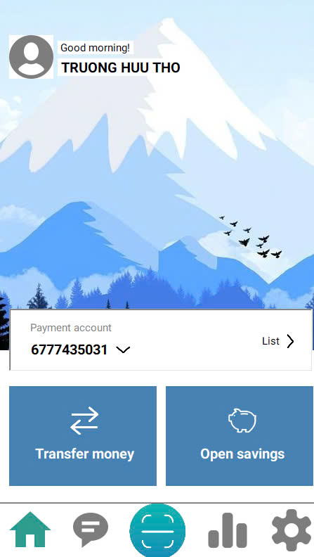

# 💸 METAN - Banking App (simulator)
## 🏦 About METAN Banking
Welcome to **METAN Banking** - a comprehensive banking application designed to provide a seamless and secure banking experience. Developed using C# and WinForms, and powered by SQL Server Management, BankApp offers a wide range of features to manage your financial needs.
## 🌟 Features
- **User Authentication**: 
  - **Login and Registration**: Secure login and easy registration process.
  - **Password Reset**: Reset your password by receiving a new one through your registered Gmail.

- **Account Management**:
  - **Initial Balance**: Each newly created account starts with a default balance of 500,000 VND.
  - **Internal and External Transfers**: 
    - Transfer money within the bank.
    - Simulate transfers to other banks.
  - **Balance Notifications**: Receive alerts whenever there is a change in your account balance.
  - **Transaction Filters**: View your transaction history within a specified date range using advanced filters.
  - **QR Code Scanning**: Easily transfer money by scanning QR codes.
  - **Savings Account**: Open and manage your savings account effortlessly.
## 🌏 Languages 
- Currently support 1 language: __English__ .
## 🚀 Getting Started
Ready to use METAN? Follow these steps to get started:
1. Create a folder named 'C#' in your computer's C drive. (Required)
2. Clone this project.
3. Open file `Banking.sql` in path `C:\C#\METAN-Banking\SQL` and execute the command in it.
4. Run file `BTTH03.exe` in path `C:\C#\METAN-Banking\BTTH03\bin\Debug\net8.0-windows` and enjoy the app. ✔️
## ⚠️ Important Notice
When you __first__ clone the METAN application, you may encounter issues connecting to the database. This is a common setup step that requires some configuration:
- The application uses __SQL Server__ as its database. To connect to the database, you'll need to modify the connection string __(strCon)__ in the application’s configuration files.
- If you're unfamiliar with __connecting to a SQL Server database__, please refer to tutorials on YouTube. Search for __"How to connect to SQL Server database in [your development environment]"__ for step-by-step guidance.
## 🛠️ Technologies Used
- **Programming Language**: C#
- **Framework**: WinForms
- **Database Management**: SQL Server Management Studio
## 👀 Demo

